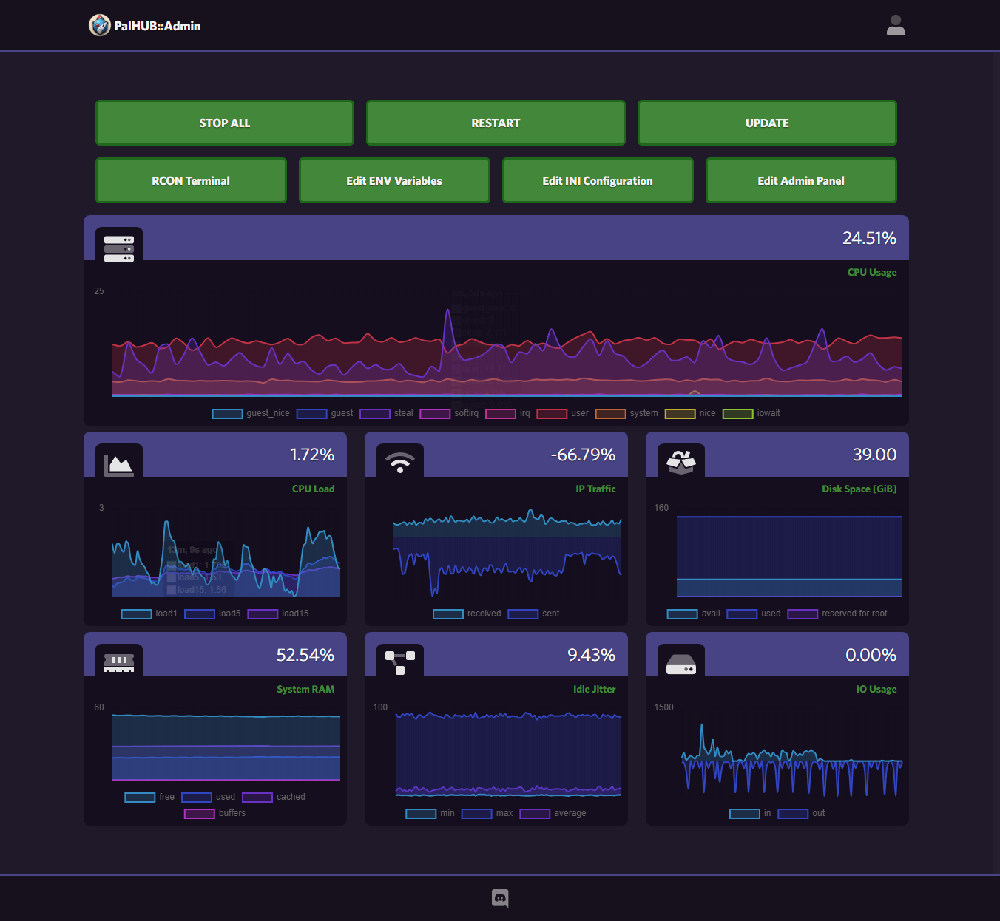

# PalHUB::Server
Easily run the windows palworld server on linux with full ue4ss mod-loading support, a website frontend for users, an admin control panel, and much more!! 

## Additional Details
PalHUB::Server is a docker compose configuration designed to run the windows version of the dedicated palworld server on linux. It does this to allow for full mod-loading functionality powered by [UE4SS](https://github.com/UE4SS-RE/RE-UE4SS), which currently only runs on windows. To achieve this, the game server container is running under proton/wine [[proton-ge-custom]](https://github.com/GloriousEggroll/proton-ge-custom) by using the [cm2network/steamcmd](https://hub.docker.com/r/cm2network/steamcmd) container as a base. 

## Features
- Run windows palworld server on linux machines
- Full mod-loading on the game server via UE4SS
- Custom website frontend for your game server
- Admin Dashboard Panel to control your server 
  - Edit Game World Settings 
  - Run RCON/REST Commands
  - {ComingSoon..} 

## Advanced Features
- NginX proxy setup to allow for advanced route/port control/password protected routes
- Netdata dashboard for full system metrics and custom server specific activity graphs
- Launcher scripts, that interface with the container to fully update via the ui. 
- {ComingSoon..}

## Web UI Endpoints
Basic: 
- / (Basic frontend for users of the server)

Admin: (password protected (htpasswd))
- /admin (the main admin panel interface)
- /logs (allows you to view the system logs folder)
- /files (allows you to view the game server files)
- /netdata (allows you to monitor full system metrics)
- /rest/{endpoint} (exposes the rest api endpoints, eg, palworldserver:8212/v1/api/{endpoint})

## Requirements
- needs docker + docker-compose on the system
- build within linux machine or wsl terminal

## Quickstart
- [Install Guide](/readme/install.md) 
- [ENV Variables](/.default.env)
- [Admin Panel Setup](/readme/admins.md)
- [Files, Mods, Backups](readme/files.md)

## Credit && Thanks
- [Tangerie](https://github.com/Tangerie) - for helping with my build issues and general idiotic questions
- [Peepoturtle](https://github.com/peepoturtle) - for their initial repo on running palworld windows server via proton

## TODO:
- allow for simple customized 'landing page' on the / route.
- validate community server listing works as intended
- netdata.conf doesnt seem to be getting properly read - fix that
  - add custom netdata panels for game specific events using statsd

